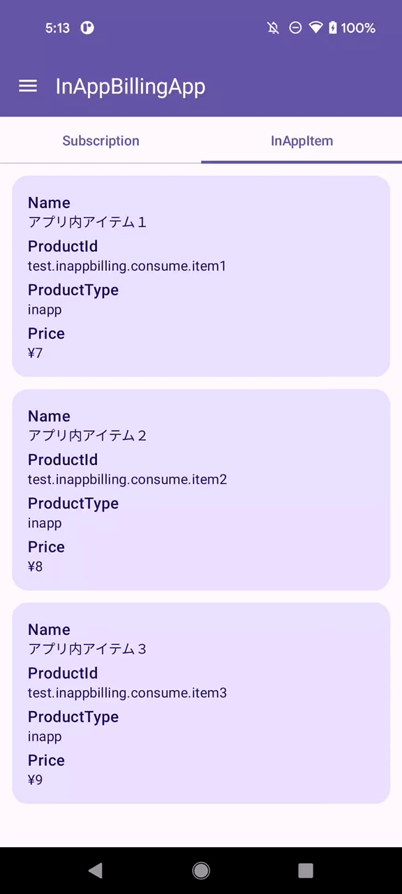
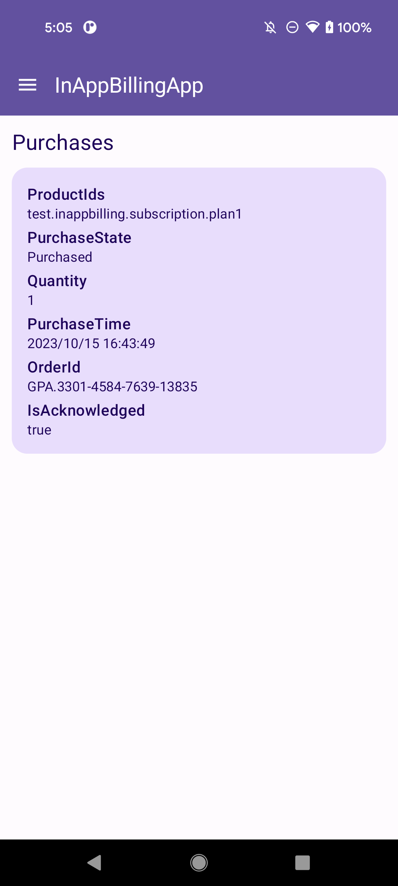
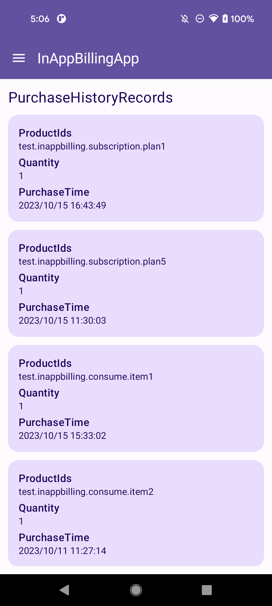

# Sample App
This is a sample app for Google Play Billing Library wrapper with Coroutine.

## Setup
### Google Play Console Setup
1. Create a new app in the Google Play Console.
2. Upload and publish the release App Bundle/APK to the Internal testing, Closed testing, Open testing, or Production track
   - See [Create and set up your app](https://support.google.com/googleplay/android-developer/answer/113469).
3. Create subscriptions and in-app item in the Google Play Console.
   - This app `Constants.kt` contains 5 subscriptions and 3 one-time products. `Constants.kt` also contains 10 plans.
   - See [Create and manage subscriptions](https://support.google.com/googleplay/android-developer/answer/140504).
   - See [Create in-app item](https://support.google.com/googleplay/android-developer/answer/1153481).

## ScreenRecord
| Subscription | In-App (Consumable Item) | Purchases | PurchaseHistoryRecords |
|:--:|:---:|:---:|:---:|
|  |  |  |  |